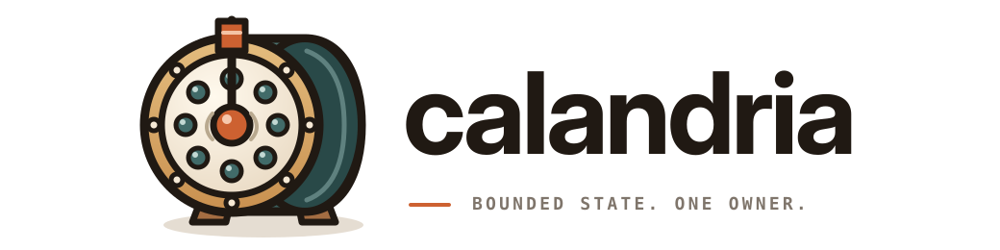

<p align="center">
  
</p>

<p align="center">
  <strong>Bounded reactor primitives with explicit ownership and deterministic progress.</strong>
</p>

<p align="center">
  Calandria provides runtime-neutral hosting, Mio readiness, and deterministic
  simulation without taking over protocol policy, scheduling, or application
  state.
</p>

<p align="center">
  <a href="#model">Model</a>
  <span> · </span>
  <a href="#crates">Crates</a>
  <span> · </span>
  <a href="#start">Start</a>
  <span> · </span>
  <a href="#qualification">Qualification</a>
</p>

<br />

## Model

```text
calandria      bounded ownership, turns, hosting, and lifecycle
calandria-mio  Mio selector, registration, wake, and token translation
calandria-sim  virtual time, deterministic scheduling, and replay
```

Each machine and resource has one mutable owner. Retained queues and buffers are
bounded. Accepted cross-thread work has an observable progress path. Production
and simulation use the same domain contracts.

## Crates

| Crate | Purpose |
| --- | --- |
| `calandria` | Core reactor, host, mailbox, timer, resource, and lifecycle contracts |
| `calandria-mio` | Backend adapter for Mio readiness mechanics |
| `calandria-sim` | Deterministic simulation, scripting, tracing, and replay |

Use only the layers you need. Concrete reactors retain ownership of their
poller, resources, I/O progress, protocol state, fairness, and shutdown policy.

## Start

```toml
[dependencies]
calandria = "=0.0.1-rc.1"
calandria-mio = "=0.0.1-rc.1"
calandria-sim = "=0.0.1-rc.1"
```

Run the bounded single-owner example from a checkout:

```sh
cargo run -p calandria --example checksum_service --all-features --locked
```

Calandria does not provide an async runtime, a general executor, or protocol
policy. Ownership, limits, progress, and terminal states stay explicit.

## Qualification

```sh
scripts/check
```

This is the complete gate for formatting, feature combinations, tests,
examples, Clippy, rustdoc, package contents, source shape, zrail architecture,
and clean diffs.

Calandria requires Rust 1.88 or newer. `0.0.1-rc.1` is a release candidate.

## License

Apache-2.0. See [LICENSE](LICENSE) and [NOTICE](NOTICE).
